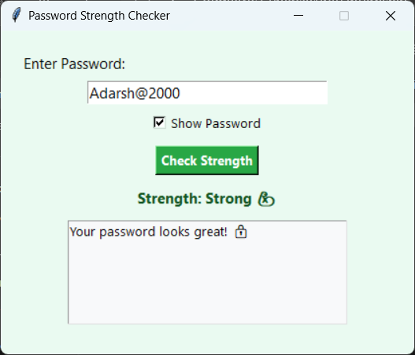

# codmetric_Password-Strength-Checker
A Python-based Password Strength Checker with a stylish Tkinter GUI. Validates password length, case, digits, and symbols using regex. Rates strength (Weak, Moderate, Strong) and offers suggestions to improve security. Includes show/hide password toggle.

# 🔐 Password Strength Checker

A stylish Python GUI app to check password strength and give improvement tips. Built with Tkinter and regular expressions, it ensures your password meets modern security standards.

---

## 🚀 Features

- ✅ Password strength rating: **Weak ❌**, **Moderate ⚠️**, **Strong 💪**
- ✅ Checks for:
  - Minimum 8 characters
  - Uppercase and lowercase letters
  - Digits
  - Special characters
- ✅ Improvement suggestions
- ✅ "Show Password" checkbox to toggle visibility
- ✅ Clean green-themed GUI
- ✅ No external libraries required

---

## 🖥️ Getting Started

1. Clone or download the repo.
2. Make sure Python is installed.
3. Run the app:

password_strength_checker.py

📦 Convert to .exe (Optional)
To create a Windows executable:
pip install pyinstaller
pyinstaller --onefile --windowed password_strength_checker_gui.py
The .exe file will be in the dist/ folder.

🖼️ Screenshot

📜 License
This project is licensed under the MIT License — feel free to use, modify, and share it.

🤝 Contributing
Contributions and improvements are welcome! Feel free to fork the repo and submit a pull request.

🔗 Connect
Made with ❤️ during a cybersecurity internship at CodMetric.
